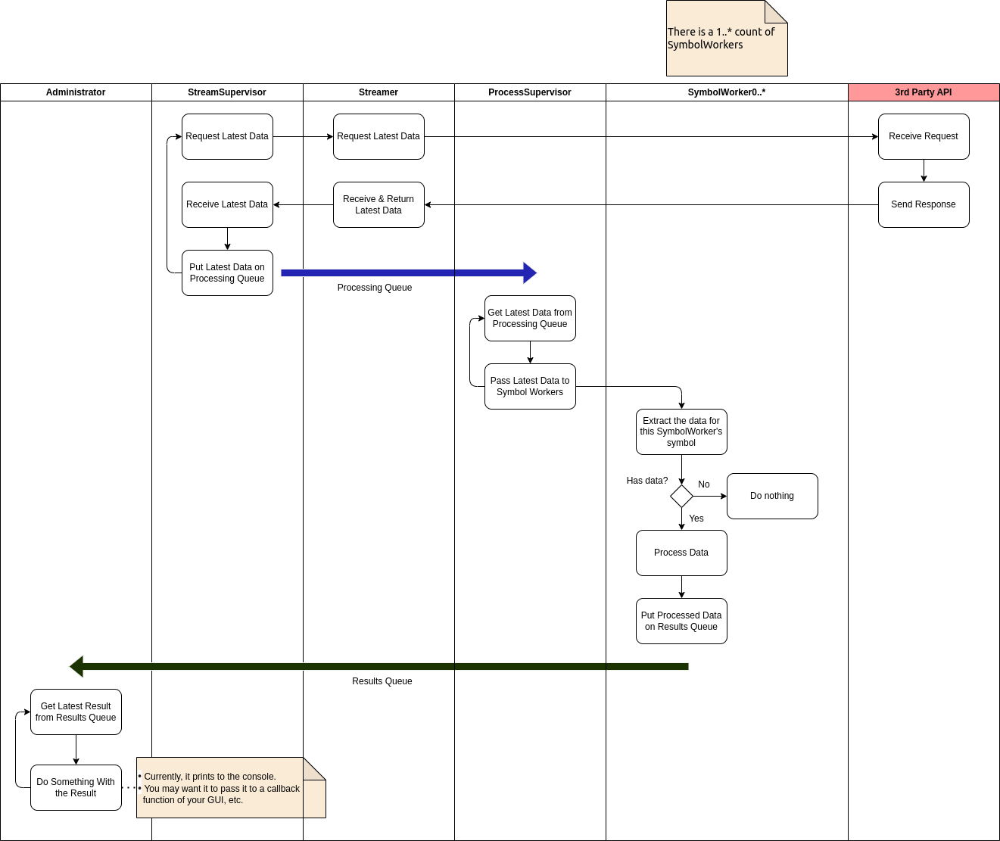
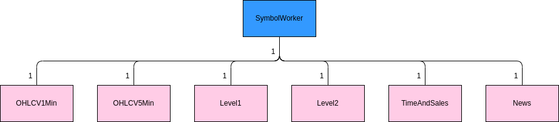

# ray-streamer: Parallel processing data from a streaming API with Ray

I created this concept application to *hopefully* help others and to garner constructive feedback as to how it might be improved.

## The Problem
Imagine you need to stream rapidly changing data from a 3rd party API.

This could be many scenarios, but this example has been created with intraday stock market data in mind: For each stock symbol you subscribe to, you might receive latest period price data (OHLCV), Level1, Level2, Time and Sales, News, etc.

The more data you are getting, with each call, and the faster the API churns it out, the more headaches you can experience when you are processing it on a single-thread (such as a typical Python application - even if you are using a blazing fast DataFrame, such as [Polars](https://pola.rs/).)

The main problems being:

- Each collection of data will be processed, in turn, resulting in any transformations / analysis being potentially slower than if you could spread that processing out to multiple *Worker*s across multiple processors.
- It's likely that your application won't be making the next call to the 3rd party API until all the latest transformations / analysis is complete. This can easily result in the server timing out your connection. That's bad! Especially for something like a trading app.

## This Solution
This solution employs multiprocessing with [Ray](https://www.ray.io/) (which I find easier to work with than the Python [multiprocessing](https://docs.python.org/3/library/multiprocessing.html) library, and it is apparently [faster](https://towardsdatascience.com/10x-faster-parallel-python-without-python-multiprocessing-e5017c93cce1).)

However, I struggled to find an existing [Ray](https://www.ray.io/) solution for streaming that truly fitted my needs. The closest I could find was: [Serve a Chatbot with Request and Response Streaming](https://docs.ray.io/en/latest/serve/tutorials/streaming.html), but a chatbot seems very different to data that might require significant processing before an application can move onto the next API call.

So... This is my *solution*. (Let me know if you do or don't agree to the *solution* part! :smiley:)

## High-Level Overview
This is basically how things look when it is running:

- Streaming takes place, on it's own process, and puts the raw results onto a Ray *processing* [Queue](https://docs.ray.io/en/latest/ray-core/api/doc/ray.util.queue.Queue.html).
  - The streamer is not waiting for current transformations, analysis, etc. to complete before it can make the next API call.
  - The 3rd party API is not having to wait for an extended period for the next API call, so it *hopefully* won't time out the connection. (Nothing is ever certain with a 3rd party!)
  - It should basically carry on grabbing data, regardless of whatever else your application is doing.
- The latest streamed data (in this example, 1 minute OHLCV data only) is grabbed from the *processing* queue and sent to individual *Worker* objects that are created to deal with data belonging to specific *labels*.
  - In this example, a *label* is a stock symbol, and a *Worker* is created for each symbol that has been subscribed to.
  - The *Worker* processes each latest period (OHLCV) as it receives that data.
  - **Note:** The latest data is actually sent to *all* the *Workers*, but they simply ignore data that is not for them.
    - This should typically be faster than having *ProcessSupervisor* determining which *Worker* specific data should be sent to.
- Once the *Worker* has completed its transformation / analysis / whatever clever stuff you want to do, it puts its latest result onto a *results* queue.
- An *Administrator* object fetches the latest result from the *results* queue in order to do whatever is required with it, after that.
  - In this case, it simply prints it to the console.
  - In other scenarios, it might hand it to a callback function of a GUI, etc. (I intend to create a simple repo that demonstrates this (somewhat tricky scenario) with [PyQt6](https://doc.qt.io/qtforpython-6/) and [QThread](https://doc.qt.io/qt-6/qthread.html), sometime in the future.)

## Potential Enhancements
### *Worker* (*SymbolWorker*)
- In the code example, it simply grabs some intraday stock price data, from a *fake* streamer, and peforms minimal processing of it directly in the appropriate *SymbolWorker* objects.
- However, supposing data is coming in for: OHLCV, Level1, Level2, Time and Sales, News, etc.?
- In such a case, *SymbolWorker* could be composed of classes to specifically hold each data-type's state and to perform specific processing upon it, e.g.:


Imagine data comes in looking something like this:
```
{
  'timestamp:': 1665427314480,
  'service': 'TIMESALE',
  'symbols': {
    'AAPL': {..}
    'TSLA': {..}
}
```

- *SymbolWorker* could easily be adapted to process it with the appropriate composite object (*TimeAndSales* in this example.)
- **Note:** Because these classes are *owned* by the *SymbolWorker* actor, there would probably be no practical reason to make them [Ray](https://www.ray.io/) actors (i.e. you would not decorate them with ```@ray.remote```)

### General
In a *real* application, you will probably want to add the facility to add an remove subscriptions (in this case stock symbols), while the process is already running.

## Results Output
When the application is run, it currently outputs to the console *similar* to the following:

```
Running... Press Ctrl-C to stop.
2024-07-12 07:15:11,795 INFO worker.py:1724 -- Started a local Ray instance.
ResultInstance(symbol='AMZN', open=199.79, high=199.84, low=199.79, close=199.84, volume=1521, unix_ts=1720522800000, new_york_datetime=datetime.datetime(2024, 7, 9, 7, 0, tzinfo=zoneinfo.ZoneInfo(key='America/New_York')))
ErrorInstance(error=<class 'ConnectionError'>, message='No more data available from API.')
ResultInstance(symbol='AMZN', open=199.85, high=199.85, low=199.85, close=199.85, volume=204, unix_ts=1720522860000, new_york_datetime=datetime.datetime(2024, 7, 9, 7, 1, tzinfo=zoneinfo.ZoneInfo(key='America/New_York')))
ResultInstance(symbol='AAPL', open=227.99, high=228.0, low=227.95, close=227.95, volume=3756, unix_ts=1720522860000, new_york_datetime=datetime.datetime(2024, 7, 9, 7, 1, tzinfo=zoneinfo.ZoneInfo(key='America/New_York')))
ResultInstance(symbol='AAPL', open=227.8, high=227.8, low=227.8, close=227.8, volume=249, unix_ts=1720522920000, new_york_datetime=datetime.datetime(2024, 7, 9, 7, 2, tzinfo=zoneinfo.ZoneInfo(key='America/New_York')))
ResultInstance(symbol='AMZN', open=199.8, high=199.8, low=199.8, close=199.8, volume=1874, unix_ts=1720522920000, new_york_datetime=datetime.datetime(2024, 7, 9, 7, 2, tzinfo=zoneinfo.ZoneInfo(key='America/New_York')))
```

### Points to Consider
1. Results will **not** always be returned in exactly the same order.
   - For example, if data for *AMZN* & *AAPL* comes in on the same stream message, the respective items will be dealt with by the *AMZN* & *AAPL* *SymbolWorker* objects in parallel, and sometimes one will finish before the other.
   - The more different symbols you are streaming, the more you will see this happen.
   - Bear this in mind for testing! (I intend to put a testing repo up sometime in the future.)
2. The *ErrorInstance*: *ConnectionError* is simulated when the application runs out of *fake* data - it's meant to happen!

## Conclusion
- This is very much a proof of concept, that would need to be amended for specific requirements.
- I am sure there are many ways to improve it and its documentation - please let me know if you can suggest some! :smiley: